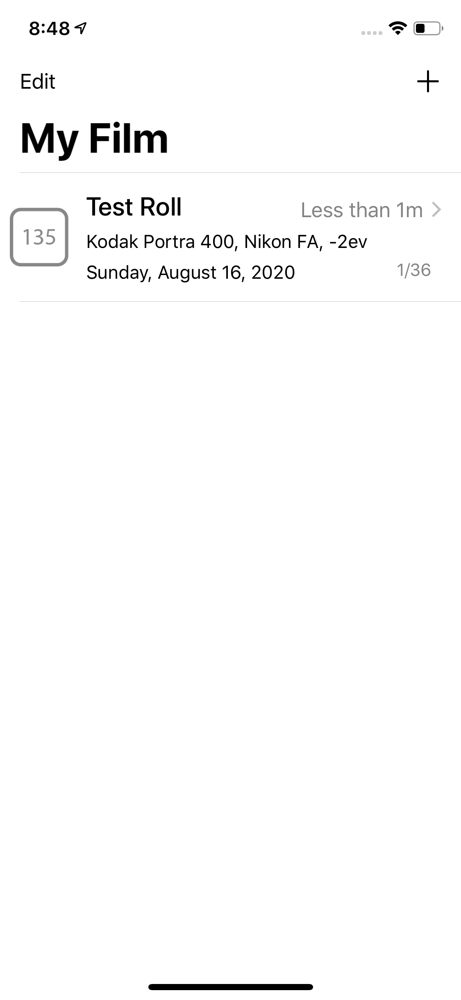
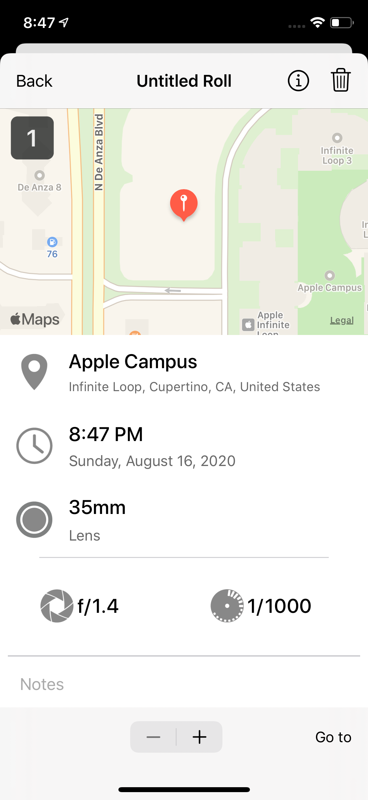
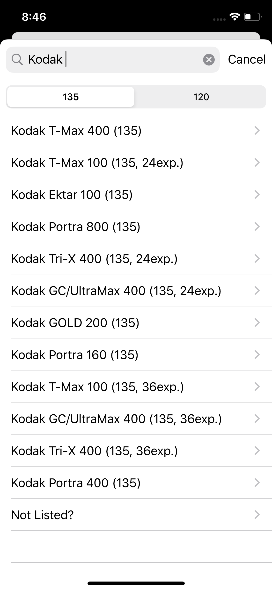
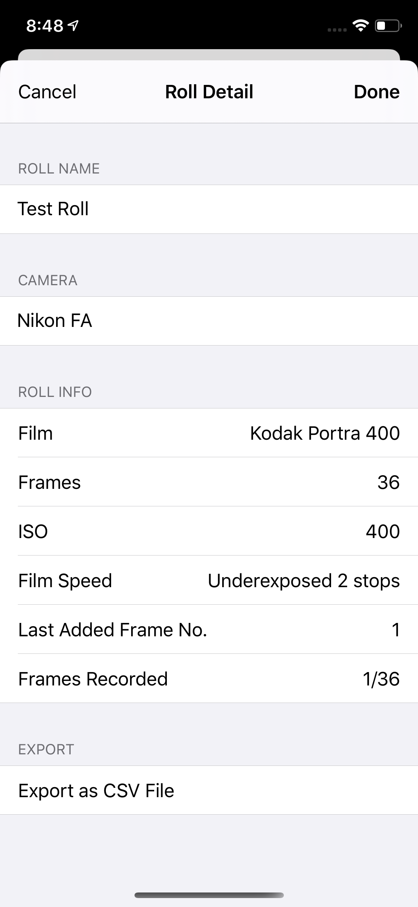
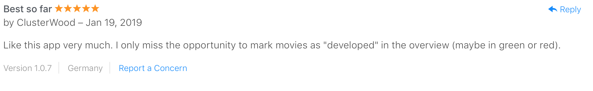
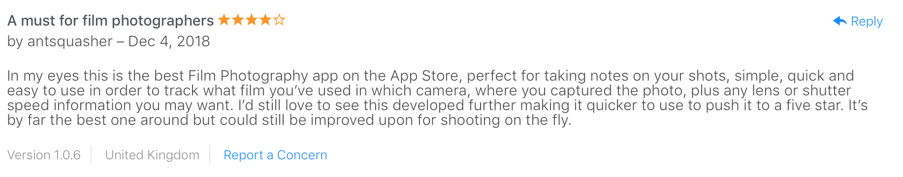
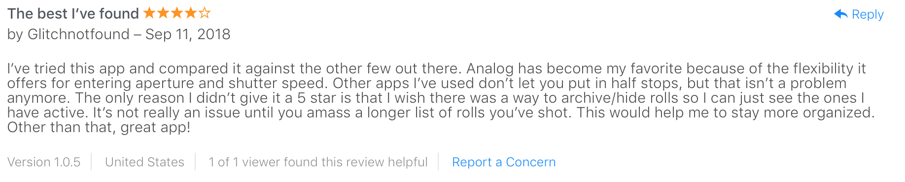

# Analog
## Aug, 2017

An iOS app written in Swift and Cocoa. Allows film photographers to note down shutter speed, date, location and notes needed for darkroom processing.

The app has a predefined list of film rolls from different brands to speed up the process of adding a roll section.

The App's main data input screen:

Home Screen:

Data Input/Lookup Screen:

Screen for searching and adding film rolls:

The screen for roll information lookup:

Positive reviews from photographers :):

Check it out on the AppStore:

https://apps.apple.com/us/app/analog-film-roll-notebook/id1265215595
